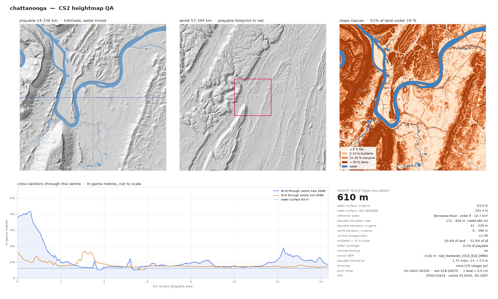

# Chattanooga

| | |
|---|---|
| **Height scale (type into the CS2 editor)** | **610 m** |
| Water surface, in-game | 63.0 m |
| Water surface, real (NAVD88) | 193.3 m (Tennessee River) |
| Centre | 35.0456, -85.3097 (EPSG:32616) |
| Playable elevation, real | 172 – 656 m (relief 485 m) |
| Vertical exaggeration | ×1.00 |
| Buildable (< 10 % slope) | 50.6% of land |
| Water coverage | 6.2% of playable |
| Channel burning | on |
| Source DEM | ~0.82 m (GA_Statewide_2018_B18_DRRA) |

## Import

1. Copy `Chattanooga_heightmap.png` and `Chattanooga_worldmap.png` to
   `%USERPROFILE%\AppData\LocalLow\Colossal Order\Cities Skylines II\Heightmaps\`.
2. In the map editor import the heightmap, then the world map.
3. Set the height scale to **610**.

## Provenance

- Built by [cs2-map-maker](https://github.com/chrisagiddings/cs2-map-maker) commit `619a188` on 2026-09-05T17:48:42
- Command: `python make_map.py --center 35.0456,-85.3097 --name chattanooga`
- Map hash `109bf4e` (from centre, CRS, vertical and channel settings; see `Chattanooga_manifest.json`)
- Elevation: USGS 3DEP · Hydrography: USGS NHDPlus HR
