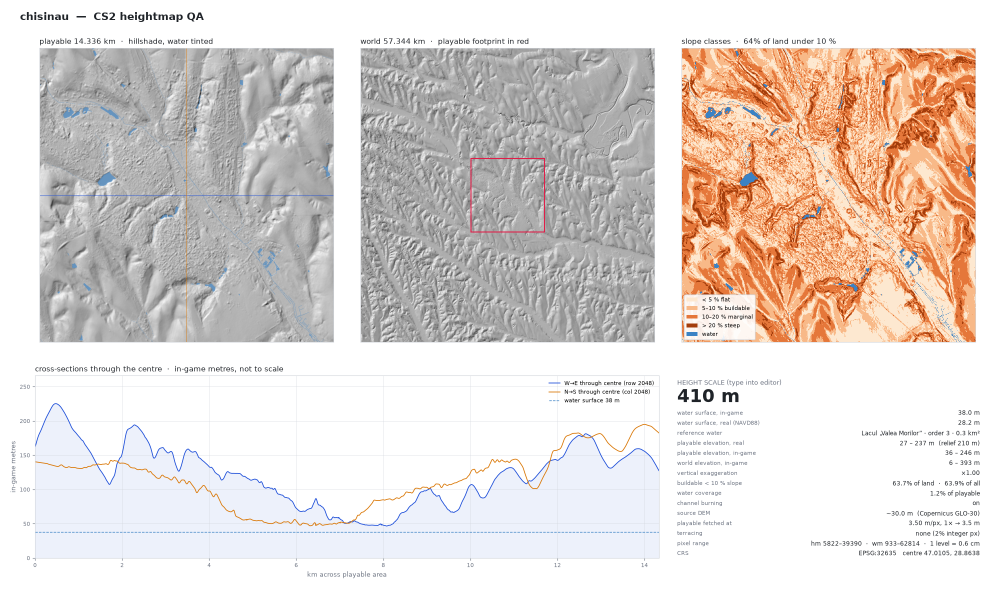

# Chisinau

| | |
|---|---|
| **Height scale (type into the CS2 editor)** | **410 m** |
| Water surface, in-game | 38.0 m |
| Water surface, real (NAVD88) | 28.2 m (Lacul „Valea Morilor”) |
| Centre | 47.0105, 28.8638 (EPSG:32635) |
| Playable elevation, real | 27 – 237 m (relief 210 m) |
| Vertical exaggeration | ×1.00 |
| Buildable (< 10 % slope) | 63.7% of land |
| Water coverage | 1.2% of playable |
| Channel burning | on |
| Source DEM | ~30.0 m (Copernicus GLO-30) |

## Import

1. Copy `Chisinau_heightmap.png` and `Chisinau_worldmap.png` to
   `%USERPROFILE%\AppData\LocalLow\Colossal Order\Cities Skylines II\Heightmaps\`.
2. In the map editor import the heightmap, then the world map.
3. Set the height scale to **410**.

## Provenance

- Built by [cs2-map-maker](https://github.com/chrisagiddings/cs2-map-maker) commit `c85848d` on 2026-09-05T18:18:55
- Command: `python make_map.py --site chisinau`
- Map hash `44c129b` (from centre, CRS, vertical and channel settings; see `Chisinau_manifest.json`)
- Elevation: USGS 3DEP · Hydrography: USGS NHDPlus HR
